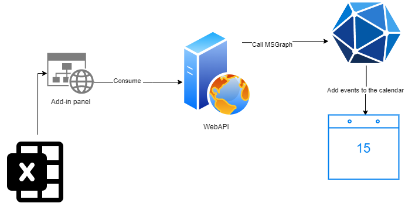
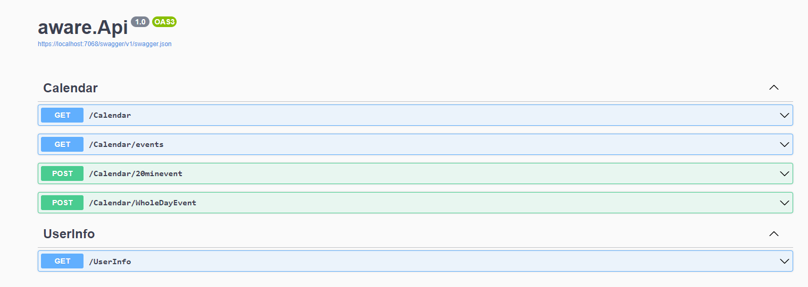
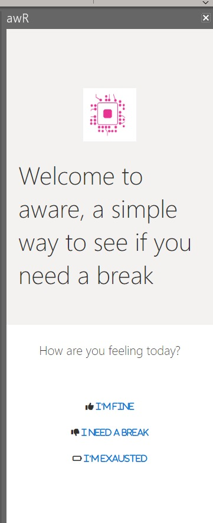
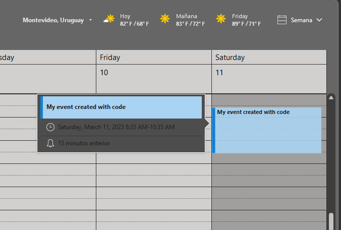
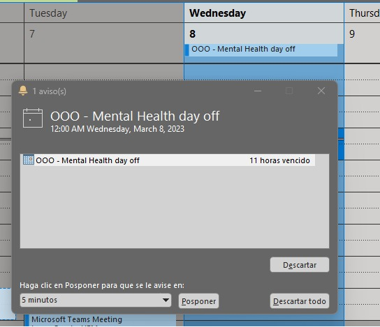

# MSGraphMentalAware

## The problem we're solving
These days is very common to see people strugling with depression and mental health. The _WHO (World Health Organzacion)_ said we [need to transform mental health](https://www.who.int/news/item/17-06-2022-who-highlights-urgent-need-to-transform-mental-health-and-mental-health-care)

## The solution?
Create a WebAPI to access the user's calendar and manage the comming events and reschedule if needed so he/she can take a small or long break.

## Features

- Ask the user how is feeling right now.
- Make a quick 20min meeting in theuser calendar, so he/she can take a break.
- Block the calendar with a all-day appoitment when the user say is not feelig well. 

## Presentation and demo

## Solution Diagram

## ScreenShots

**Swagger view**  

**Office Outlook add-in panel**  

**Crete short 20min event to take a break**  
  
  

**Out of the Office created with Graph**  

## TODO
- Reschedule meetings if you have an appointment collision
- Add the add-in project to work as the fronted of the project

## Ideas for version 0.2
* Track daily moods and prenset as a chart to the user so he can visualize how is 
* NOtify the manager of the user who is struglinig with his daily tasks
* Create a MS Teams bot to interact with the API
